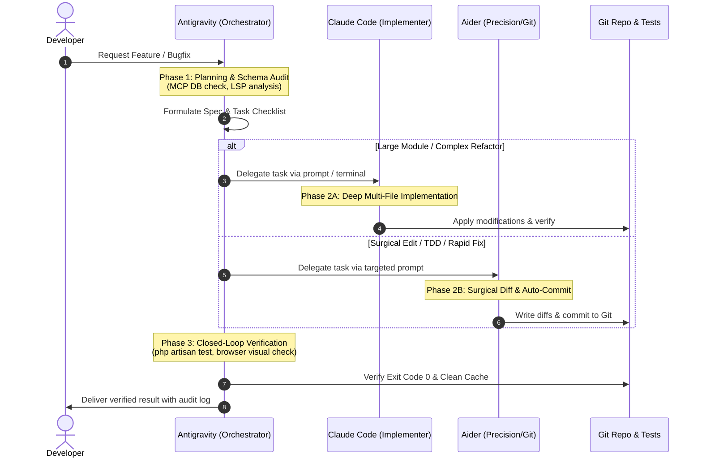

# Multi-Agent Orchestration & Workflow Protocols
# Antigravity (Gemini) • Claude Code • Aider

This document establishes the official multi-agent division of labor, state synchronization protocol, and execution pipeline for the **Sistem Informasi Manajemen Magang** repository.

---

## 1. Multi-Agent Ecosystem & Division of Labor

```
+-----------------------------------------------------------------------------------+
|                        ANTIGRAVITY (Gemini 3.8 / IDE)                             |
|               Lead AI System Architect & Workspace Orchestrator                   |
|  - MCP Database Audits (PostgreSQL)      - Browser E2E Vision & DOM Validation   |
|  - High-Level Architecture & Planning    - AST Code Navigation & Diagnostics      |
|  - Task Breakdown & Spec Delegation      - Final QA Review & Exit Code 0 Check    |
+-----------------------------------------+-----------------------------------------+
                                          |
                +-------------------------+-------------------------+
                |                                                   |
                v                                                   v
+---------------------------------------+   +---------------------------------------+
|              CLAUDE CODE              |   |                 AIDER                 |
|       Deep Autonomous Implementer     |   |      Precision In-Place Programmer    |
|  - Complex multi-file refactoring     |   |  - Surgical file modifications        |
|  - Algorithmic & domain layer coding  |   |  - Fast TDD / Unit test authoring     |
|  - Architecture & Service classes     |   |  - Automatic, structured Git commits  |
|  - Project-wide dependency fixes      |   |  - Token-efficient micro-iterations   |
|  Run: `claude`                        |   |  Run: `aider --sonnet` or `--deepseek`|
+---------------------------------------+   +---------------------------------------+
```

---

## 2. Detailed Role Specifications

### A. Antigravity (The Master Orchestrator)
- **Role:** System Architect, QA Director, and Workspace Conductor.
- **Responsibilities:**
  1. **Schema & State Verification:** Use PostgreSQL MCP tools (`query`) to inspect actual schema and foreign keys before designing features.
  2. **Architectural Blueprints:** Produce actionable specification files in `.antigravity/specs/` or prompt instructions containing exact file paths, method signatures, and acceptance criteria.
  3. **Visual & Browser Verification:** Automate headless and visual browser sessions (`hermes_*.mjs` or Playwright) against `http://127.0.0.1:8000` to verify live UI/UX, responsive layouts, and zero console errors.
  4. **Quality Gatekeeper:** Execute `php artisan optimize:clear`, `php artisan test`, and verify **Strict Exit Code 0**. Reject or trigger self-healing if failures occur.

### B. Claude Code (The Deep Autonomous Implementer)
- **Role:** Heavy-lifting Autonomous Module Implementer.
- **When to Use:**
  - Building new domain modules end-to-end (e.g., Services, Repositories, Events, Listeners).
  - High-complexity refactoring across multiple interrelated files.
  - Resolving deep architectural inconsistencies or complex algorithm design.
- **Workflow:**
  - Launch inside workspace: `claude` (or via helper script `.\scripts\start-agents.ps1 -Claude`).
  - Feed the specification prepared by Antigravity.
  - Claude reads context, navigates the codebase, applies multi-file changes, and verifies module integrity.

### C. Aider (The Precision Pair Programmer & Git Synchronizer)
- **Role:** Surgical In-Place Pair Programmer & Git Synchronizer.
- **When to Use:**
  - Single-file or focused multi-file edits (Controller methods, Blade components, Form Requests).
  - Writing Pest / PHPUnit test cases matching specific method signatures.
  - Incremental git commit management with clean, conventional commit messages.
- **Workflow:**
  - Launch inside workspace: `aider --sonnet` or `.\scripts\start-agents.ps1 -Aider`.
  - Add target files explicitly: `/add app/Http/Controllers/ExampleController.php`.
  - Give concise, targeted directives. Aider applies surgical diffs, runs tests if configured, and auto-commits.

---

## 3. Inter-Agent Communication & Task Handoff Protocol

To ensure seamless coordination without race conditions or conflicting file writes, all agents follow this 4-step pipeline:



### Handoff Rules:
1. **Single Writer Rule:** Only one agent (Claude Code OR Aider OR Antigravity) actively modifies code files at any single moment.
2. **Clean Working Tree:** Before switching between Claude Code and Aider, ensure uncommitted changes are staged or committed (`git status` is clean).
3. **Spec-Driven Prompts:** When passing tasks from Antigravity to Claude Code or Aider, include:
   - Target file paths with line numbers (e.g. `app/Services/ApplicationService.php`).
   - Expected behavior and type annotations (PHP 8.2+).
   - Any database constraints verified via PostgreSQL MCP.

---

## 4. Environment & Credentials Configuration

API credentials for external LLM CLI engines are managed via `.env.agents` in the project root:

| Variable | Description | Used By |
| :--- | :--- | :--- |
| `ANTHROPIC_API_KEY` | Anthropic API key for Claude models | Claude Code, Aider (`--sonnet`) |
| `DEEPSEEK_API_KEY` | DeepSeek API key for high-speed coding | Aider (`--deepseek`) |
| `OPENAI_API_KEY` | OpenAI API key for GPT-4o / o-series | Aider (`--4o`, `--model o3-mini`) |
| `GEMINI_API_KEY` | Google Gemini API key | Aider (`--model gemini/...`) |

> **Security Note:** `.env.agents` is explicitly excluded in `.gitignore`. Never commit raw API keys to Git.

---

## 5. Quick Command Cheatsheet

### Launching Aider
```powershell
# Using the launcher script (loads .env.agents automatically)
.\scripts\start-agents.ps1 -Aider

# Direct CLI options:
aider --sonnet                                # Claude 3.7 / 3.5 Sonnet
aider --model deepseek/deepseek-coder        # DeepSeek Coder
aider --4o                                    # OpenAI GPT-4o
```

### Launching Claude Code
```powershell
# Using the launcher script (loads .env.agents automatically)
.\scripts\start-agents.ps1 -Claude

# Direct CLI:
claude
```

### Verifying Environment
```powershell
.\scripts\start-agents.ps1 -Check
```
