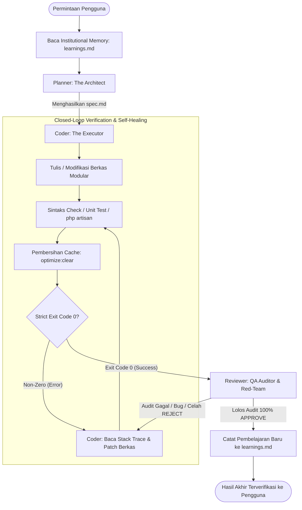

# AGENTS.md — Master Rules & Context Entry Point

Selamat datang di repositori proyek **Sistem Informasi Manajemen Magang**. Berkas ini berfungsi sebagai titik masuk (*master entry point*) bagi orkestrasi multi-agen kecerdasan buatan (*Autonomous Multi-Agent Swarm Orchestration*), protokol *Closed-Loop Self-Healing*, dan insinyur pengembang.

---

## 1. Ikhtisar Stack Teknologi

- **Backend**: Laravel (PHP 8.2+)
- **Frontend**: Blade Templating Engine + Tailwind CSS + Alpine.js
- **Database**: PostgreSQL (Relational, JSONB, ACID transactions)
- **Asset Bundler**: Vite
- **Package Manager**: Composer & NPM

---

## 2. Autonomous Multi-Agent Swarm Orchestration (`.antigravity/agents/`)

Pengembangan sistem dijalankan secara modular menggunakan 3 persona agen spesialis dengan batasan ketat:

| Persona Agen | Dokumen Profil | Peran & Batasan Utama |
| :--- | :--- | :--- |
| **Planner** (*The Architect*) | **[.antigravity/agents/planner.md](.antigravity/agents/planner.md)** | Menganalisis kebutuhan, mengaudit skema PostgreSQL via MCP, membaca `learnings.md`, menyusun blueprint teknis `spec.md`. **Dilarang langsung memodifikasi file kode.** |
| **Coder** (*The Executor*) | **[.antigravity/agents/coder.md](.antigravity/agents/coder.md)** | Mengimplementasikan kode modular sesuai `spec.md`, menjalankan siklus verifikasi terminal (Strict Exit Code 0), serta mengeksekusi *Self-Healing* jika terjadi error. **Dilarang melompat file (*no file jumping*) sebelum file aktif bebas error sintaks.** |
| **Reviewer** (*QA & Red-Team*) | **[.antigravity/agents/reviewer.md](.antigravity/agents/reviewer.md)** | Mengaudit celah keamanan (SQL Injection, CSRF, XSS), kepatuhan UI Tailwind/media logo, validasi Exit Code 0, dan pembersihan cache. **Memiliki hak veto mutlak untuk menolak hasil kerja dan memicu loop self-healing.** |

---

## 3. Protokol Closed-Loop Self-Healing & Continuous Evolution

Alur pengerjaan setiap tugas menerapkan handoff berjenjang yang tertutup dan tervalidasi otomatis di level terminal:

### Mekanisme Inti Protokol:
1. **Pemeriksaan Memori Awal**: Di setiap awal sesi, **Planner** dan **Coder** wajib menelaah [.antigravity/memory/learnings.md](.antigravity/memory/learnings.md) guna mengidentifikasi anti-pattern dan solusi yang telah terbukti.
2. **Closed-Loop Verification (Strict Exit Code 0)**:
   - Setelah berkas kode (Route, Controller, View, Model, Migration) selesai diedit, Coder wajib memvalidasi sintaks terminal (`php -l`, tes unit, pengecekan route) dan membersihkan cache (`php artisan optimize:clear` atau `view:clear`).
   - Apabila terdeteksi error (exit code $\neq$ 0), sistem masuk ke siklus **Self-Healing mandiri** tanpa intervensi pengguna hingga error tuntas teratasi (exit code = 0).
3. **Continuous Self-Evolution**:
   - Setiap kali terjadi insiden perbaikan atau trik PostgreSQL/Blade baru, solusi dicatat ke [.antigravity/memory/learnings.md](.antigravity/memory/learnings.md).

---

## 4. Institutional Memory Hub (`.antigravity/memory/`)

Pusat dokumentasi memori persisten sistem:

| Berkas Memori | Deskripsi & Kegunaan |
| :--- | :--- |
| **[learnings.md](.antigravity/memory/learnings.md)** | Basis pengetahuan persistent yang mencatat *Problem/Symptom*, *Root Cause*, *Fix Applied*, dan *Prevention Rule* untuk mencegah regresi bug secara permanen. |

---

## 5. Direktori Aturan Modular (`.antigravity/rules/`)

Seluruh agen wajib mematuhi standar baku modular di direktori [rules](.antigravity/rules/):

| Dokumen Aturan | Lingkup & Cakupan Pembahasan |
| :--- | :--- |
| **[architecture.md](.antigravity/rules/architecture.md)** | Prinsip SOLID, Clean Architecture, kewajiban ekstraksi **Service Layer** jika Controller > 100 baris, konvensi RESTful Resource Controller, dan penamaan rute standar Laravel. |
| **[database.md](.antigravity/rules/database.md)** | Standar PostgreSQL, pemilihan tipe data (`id`, `uuid`, `jsonb`, `timestamps`), larangan mutlak raw query tanpa parameter binding, foreign key constraints, serta strategi indexing. |
| **[media.md](.antigravity/rules/media.md)** | Standar format logo instansi mitra (SVG, PNG transparan, WebP), pemanggilan aset via `asset('storage/logos/...')`, dan teknik pencegahan distorsi dengan Tailwind CSS (`object-contain`). |
| **[quality.md](.antigravity/rules/quality.md)** | Standar antarmuka responsif (*mobile-first*), konsistensi palet warna sistem, micro-interactions, serta kewajiban pembersihan cache (`php artisan optimize:clear`, `view:clear`, `route:clear`). |

---

## 6. Boundary & Konteks Kerja (`.agentignore`)

Aktivitas pemindaian file oleh agen dibatasi oleh [.agentignore](.agentignore) untuk mengecualikan direktori berat (`node_modules/`, `vendor/`, `.git/`, `storage/logs/`, `storage/framework/`, `public/build/`). Berkas media, aset statis, dan logo instansi diizinkan secara mutlak melalui *whitelist*:
- `public/images/`
- `public/assets/logos/`
- `storage/app/public/`
- `public/storage/`
