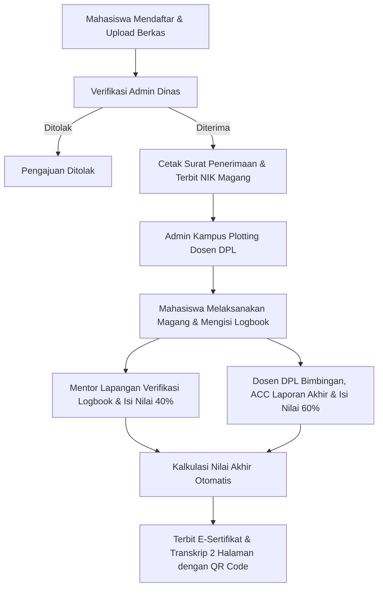

# 🏛️ SIP-MAGANG | Sistem Informasi Praktik Kerja & Magang
### Badan Perencanaan Pembangunan Daerah, Penelitian dan Pengembangan (Bappeko) & Pemerintah Kota Surabaya

[](https://laravel.com)
[](https://www.postgresql.org/)
[](https://tailwindcss.com/)
[](https://alpinejs.dev/)
[](LICENSE)

---

## 📌 Tentang Proyek

**SIP-MAGANG** adalah platform terintegrasi berbasis web yang dirancang khusus untuk mengelola seluruh siklus hidup program magang, praktik kerja lapangan (PKL), dan riset akademis di lingkungan **Pemerintah Kota Surabaya**. 

Sistem ini menjembatani kolaborasi pentahelix antara **Pemerintah Kota (Super Admin & Admin Dinas)**, **Mentor Lapangan**, **Perguruan Tinggi (Admin Universitas & Dosen Pembimbing Lapangan/DPL)**, dan **Mahasiswa**.

---

## 🌟 Fitur Utama Sistem

1. **📊 Dual-Weight Academic & Field Grading System**:
   - Penghitungan nilai akhir terbobot otomatis:
     $$\text{Nilai Akhir} = (40\% \times \text{Nilai Pembimbing Lapangan}) + (60\% \times \text{Nilai Dosen Pembimbing/DPL})$$
   - Penilaian mentor dinas mencakup Kedisiplinan, Kinerja, dan Laporan Lapangan.
   - Penilaian DPL mencakup Penguasaan Materi/Teknis, Sistematika Laporan Ilmiah, dan Sikap/Keaktifan Bimbingan.

2. **📜 E-Sertifikat Kelulusan 2 Halaman Landscape & Verifikasi QR**:
   - **Lembar 1**: E-Sertifikat Kelulusan Resmi dengan tanda tangan digital, stempel dinas, dan QR Code verifikasi keaslian publik.
   - **Lembar 2**: Transkrip Nilai Gabungan lengkap (rincian skor 40% dinas + 60% DPL beserta konversi predikat huruf SIAKAD).
   - Dilengkapi *Print CSS Engine* siap cetak ke format PDF atau kertas fisik tanpa merusak tata letak.

3. **🔄 Sistem Impersonasi Akun Cepat (Quick Switcher)**:
   - Tombol pengalihan peran instan untuk mempermudah pengujian alur (*End-to-End Testing*) antar 6 level hak akses tanpa perlu logout/login manual.

4. **📝 Monitoring Logbook & Verifikasi Laporan Akhir**:
   - Pengisian jurnal harian/mingguan mahasiswa disertai unggahan bukti kegiatan.
   - Review berkas naskah laporan akhir dengan status *Pending*, *Revisi*, dan *Disetujui (ACC)*.

5. **🏢 Manajemen Kuota & Multi-Tenancy Organisasi**:
   - Manajemen pembagian unit kerja/divisi dan kuota penerimaan mahasiswa secara real-time.
   - Master data instansi dinas, universitas mitra, dan akun pengguna.

6. **🎨 Surabaya Blue Theme UI/UX**:
   - Antarmuka modern, responsif, dan elegan dengan palet warna resmi biru Surabaya, dilengkapi komponen *glassmorphism* dan transisi interaktif.

---

## 👥 Matriks 6 Hak Akses & Akun Demo Default

Sistem menyediakan kredensial bawaan (*seeder*) untuk memudahkan evaluasi dan demonstrasi:

| No | Peran / Hak Akses | Email Demo | Password Default | Lingkup Wewenang Utama |
| :---: | :--- | :--- | :---: | :--- |
| **1** | **Super Admin** | `superadmin@surabaya.go.id` | `password` | Kendali penuh sistem, master dinas, universitas, & akun |
| **2** | **Admin Dinas** | `admin.kominfo@surabaya.go.id` | `password` | Verifikasi berkas pengajuan, plotting kuota, cetak surat |
| **3** | **Mentor Lapangan** | `mentor.kominfo@surabaya.go.id` | `password` | Bimbingan teknis dinas, verifikasi logbook, nilai dinas (40%) |
| **4** | **Admin Universitas** | `admin@unesa.ac.id` | `password` | Monitoring mahasiswa kampus, plotting DPL pembimbing |
| **5** | **Dosen DPL** | `dosen.unesa@unesa.ac.id` | `password` | Bimbingan karya ilmiah, ACC laporan akhir, nilai DPL (60%) |
| **6** | **Mahasiswa** | `mahasiswa@unesa.ac.id` | `password` | Pendaftaran magang, pengisian logbook, unduh sertifikat |

---

## 🔄 Alur Siklus Hidup Magang (Workflow Lifecycle)



---

## 💻 Kebutuhan Sistem

- **PHP**: `^8.2` atau `^8.3`
- **Composer**: `^2.6`
- **Node.js**: `^18.x` atau `^20.x` & **NPM**
- **Database**: PostgreSQL `^14.x` / `^15.x` / `^16.x` (atau MySQL `^8.0`)
- **Ekstensi PHP**: `pdo_pgsql`, `pgsql`, `gd`, `zip`, `mbstring`, `openssl`, `tokenizer`, `xml`, `ctype`, `json`, `bcmath`, `curl`.

---

## 🚀 Panduan Instalasi & Menjalankan Aplikasi

### 1. Kloning Repositori
```bash
git clone https://github.com/raveldanz/Magang.git
cd Magang
```

### 2. Pasang Dependensi Backend & Frontend
```bash
composer install
npm install
```

### 3. Konfigurasi Environment (`.env`)
Salin file template `.env.example` menjadi `.env`:
```bash
cp .env.example .env
```
Buka file `.env` dan sesuaikan koneksi database PostgreSQL Anda:
```env
APP_NAME="SIP-MAGANG Surabaya"
APP_ENV=local
APP_KEY=
APP_DEBUG=true
APP_URL=http://127.0.0.1:8000

DB_CONNECTION=pgsql
DB_HOST=127.0.0.1
DB_PORT=5432
DB_DATABASE=sip_magang_db
DB_USERNAME=postgres
DB_PASSWORD=your_password
```

### 4. Generate Application Key & Tautkan Storage
```bash
php artisan key:generate
php artisan storage:link
```

### 5. Jalankan Migrasi & Database Seeder (Demo Data Lengkap)
Jalankan migrasi basis data beserta seeder E2E untuk menyiapkan seluruh 6 peran pengguna dan data simulasi magang:
```bash
php artisan migrate:fresh --seed
```
> **Catatan**: Seeder `DatabaseSeeder` secara otomatis menjalankan `DemoE2ESeeder` yang menyiapkan data mahasiswa, instansi Kominfo, UNESA, mentor, dosen DPL, logbook, laporan akhir, hingga e-sertifikat terverifikasi.

### 6. Build Asset & Jalankan Server Lokal
Buka dua jendela terminal untuk menjalankan asset bundler dan server Laravel:

**Terminal 1 (Vite Dev Server):**
```bash
npm run dev
```

**Terminal 2 (Laravel Server):**
```bash
php artisan serve
```

Aplikasi kini dapat diakses melalui peramban web pada alamat:
👉 **[http://127.0.0.1:8000](http://127.0.0.1:8000)**

---

## 🧪 Panduan Pengujian & Demo Alur

1. **Uji Coba Mahasiswa**:
   - Login dengan `mahasiswa@unesa.ac.id` / `password`.
   - Buka menu **Dashboard**, pantau status magang aktif, isi logbook harian, atau unduh **E-Sertifikat & Nilai**.
2. **Uji Coba Dosen DPL**:
   - Gunakan Quick Role Switcher atau login `dosen.unesa@unesa.ac.id`.
   - Buka menu **Monitoring Mahasiswa**, lakukan review naskah Laporan Akhir (Setujui/Revisi), dan isi **Formulir Nilai Akademik DPL (60%)**.
3. **Uji Coba Mentor Dinas**:
   - Login `mentor.kominfo@surabaya.go.id`.
   - Lakukan verifikasi dan berikan feedback logbook, serta input **Penilaian Evaluasi Lapangan (40%)**.
4. **Uji Coba Admin Dinas & Super Admin**:
   - Cetak **Surat Penerimaan Resmi** dan terbitkan **E-Sertifikat Kelulusan**.
   - Buka tautan QR Code pada sertifikat untuk melihat verifikasi publik terbuka.

---

## 📂 Struktur Direktori Utama

```text
├── app/
│   ├── Http/Controllers/
│   │   ├── Admin/            # Controller Super Admin & Admin Dinas
│   │   ├── Lecturer/         # Controller Dosen Pembimbing Lapangan (DPL)
│   │   ├── Mentor/           # Controller Mentor Lapangan Dinas
│   │   ├── Student/          # Controller Portal Mahasiswa
│   │   └── University/       # Controller Administrator Universitas
│   ├── Models/               # Model Eloquent (User, Application, Placement, Evaluation, etc.)
│   └── Services/             # Business Logic & Helpers
├── database/
│   ├── migrations/           # Skema Tabel Basis Data
│   └── seeders/              # DemoE2ESeeder & Master Data
├── resources/
│   ├── css/                  # Styling Tailwind CSS & Custom Theme
│   ├── js/                   # JavaScript & Alpine.js Components
│   └── views/                # Template Blade (Admin, Lecturer, Mentor, Student, University)
├── routes/
│   ├── web.php               # Rute Web Terproteksi Role & Middleware
│   └── auth.php              # Rute Autentikasi Laravel Breeze
└── public/                   # Asset Publik, Gambar, & Dokumen
```

---

## 📄 Lisensi

Proyek aplikasi ini dikembangkan untuk kebutuhan operasional Praktik Kerja Lapangan dan Magang Pemerintah Kota Surabaya di bawah lisensi terbuka [MIT License](LICENSE).
